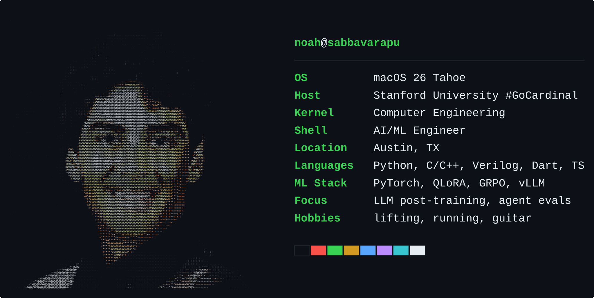
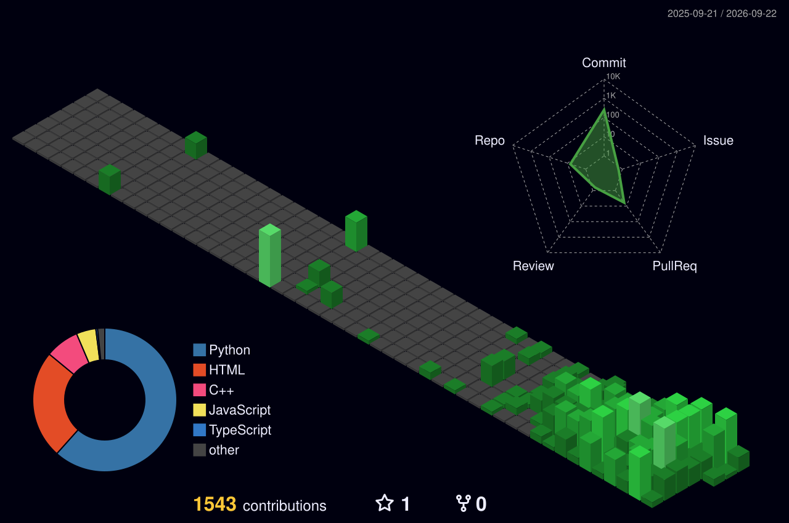

<!-- neofetch-style card: ASCII portrait + stats (built via scratchpad/neofetch_card.py) -->

  

<!-- 3D contribution graph (night green). Generated daily by .github/workflows/profile-3d.yml -->

